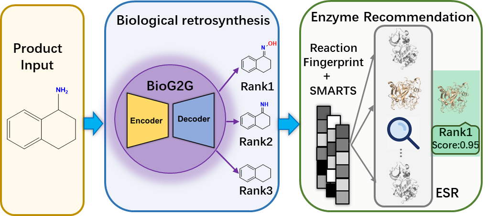
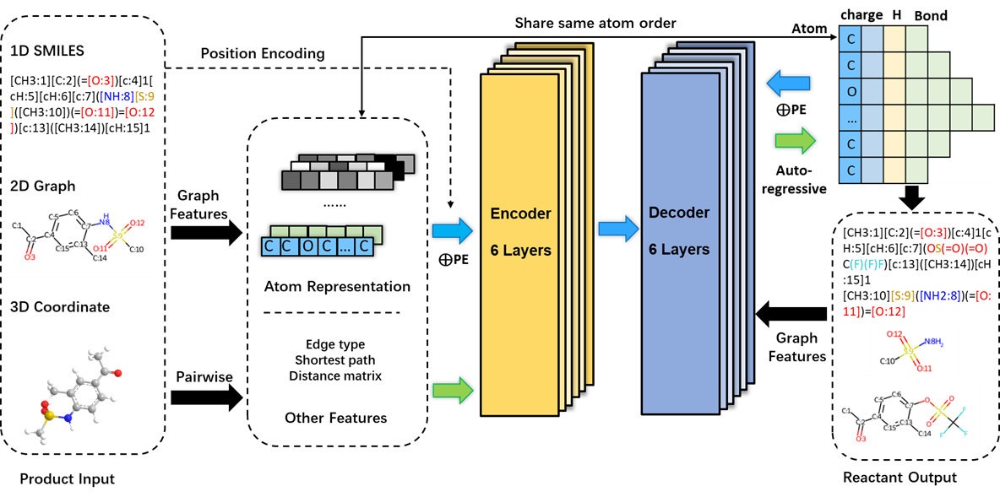

# BioG2G_ESR
Unified Graph-to-Graph Retrosynthesis and Enzyme Sequence Recommendation for Biocatalytic Design



## 1. Installation
System Requirements
```
Python ≥ 3.8

PyTorch 2.0

CUDA 11.8

Linux (tested on Ubuntu)
```
### 1.1 Create a Conda Environment

We recommend creating a dedicated conda environment for BioG2G.
```
conda create --name BioG2G_ESR python=3.8
conda activate BioG2G_ESR
```
Install PyTorch 2.0 with CUDA 11.8:
```
conda install pytorch==2.0.0 torchvision==0.15.0 torchaudio==2.0.0 pytorch-cuda=11.8 -c pytorch -c nvidia
```
### 1.2 Install Unicore

BioG2G is built on top of the Unicore framework.

First install Rust (required for compiling dependencies):
```
curl --proto '=https' --tlsv1.2 -sSf https://sh.rustup.rs | sh
source "$HOME/.cargo/env"
```
Then install the precompiled Unicore package:
```
pip install unicore-0.0.1+cu118torch2.0.0-cp38-cp38-linux_x86_64.whl
```
Install additional utilities:
```
pip install matplotlib cmake lit
```
### 1.3 Install UniMol+

Install the UniMol+ module included in this repository:
```
cd unimol_plus
pip install .
```
### 1.4 Install Additional Dependencies

Install the remaining Python libraries required for retrosynthesis modeling and data processing:
```
pip install numba rdchiral transformers tokenizers omegaconf rdkit timeout_decorator scikit-learn
```

## 2. BioG2G
BioG2G is a graph-to-graph biocatalytic retrosynthesis model that predicts possible reactant molecules from a given target product.
Given a product as input, the model generates plausible precursor structures that could lead to the target compound through enzymatic reactions.



### 2.1 Download Dataset and Checkpoints

Before running BioG2G, please download the required dataset and model checkpoints, and place them in the parent directory of this repository:
```
..
├── dataset
├── checkpoint
└── BioG2G
```
### 2.2 Single Molecule Inference

To perform retrosynthesis prediction for a single molecule, you can use get_result.py.

First, open get_result.py and modify the input SMILES at the end of the file:
```
smi = "CC(C)C(=O)C1=CC=CC=C1"
```
Replace it with the molecule you want to predict.

Then run:
```
export MKL_THREADING_LAYER=GNU
python get_result.py
```
The model will generate retrosynthesis predictions for the input molecule.

### 2.3 Large-scale Evaluation (Recommended)

For large-scale prediction or dataset evaluation, we recommend using the validation script, which is more efficient in terms of time and memory usage.

Run:
```
sh valid_biochem_plus.sh ../checkpoint/main/plus/checkpoint_best.pt
```
The results is located under:
```
../checkpoint/main/plus/checkpoint_best
```
### 2.4 Training

To train BioG2G on the BioChem-Plus dataset, run:
```
sh train_biochem_plus.sh
```
In the training script (train_biochem_plus.sh), you can modify the following parameter to control where the trained model checkpoints are saved:
```
save_dir="../outputs_biochem_plus/${base_name}"
```
You can change this path to specify a different directory for saving model parameters and training outputs.
## 3. Enzyme Sequence Recommender
This tool, enzyme_sequence_recommender.py, is designed to bridge the gap between retrosynthetic prediction and enzymatic validation. Once you have obtained a predicted reaction (the transformation of reactants to products), you can input it into this script to identify the most suitable enzyme sequences from a preprocessed database.


### 3.1 Workflow
The recommendation process follows a two-stage validation strategy to ensure high-accuracy results:

Phase 1: Fingerprint Filtering Uses reaction fingerprints and Tanimoto similarity to quickly retrieve the top candidates that share a similar chemical transformation logic.

Phase 2: SMARTS Substructure Ranking Performs a deep-dive verification by matching the local reaction center (SMARTS template) of the database entries against your query molecules. This ensures the enzyme's specific catalytic site is compatible with your substrate.

### 3.2 Usage
1. Prepare your Query
Organize your retrosynthetic output into a standard Reaction SMILES format: ReactantA.ReactantB>>ProductA.

2. Preprocess the Database
Ensure your JSON database (e.g., template_library_smarts_recursion.json) is in the same directory. On the first run, the script will generate a .pkl cache to speed up future queries.

3. Run the Script
You can call the recommend_enzymes function within the script:


```
from enzyme_sequence_recommender import recommend_enzymes

# Example: Amide hydrolysis or your retrosynthesis result
query = "CC1=CC=C(S(N(CC=C)CC=C)(=O)=O)C=C1>>CC1=CC=C(S(N2CC=CC2)(=O)=O)C=C1"
recommend_enzymes(query, db, top_k=10)
```

### 3.3 Output Categories
High Confidence: Candidates where the structural template matches the query reaction center perfectly.

Medium Confidence: Candidates with high fingerprint similarity but where the specific template match is weaker or not applicable.
